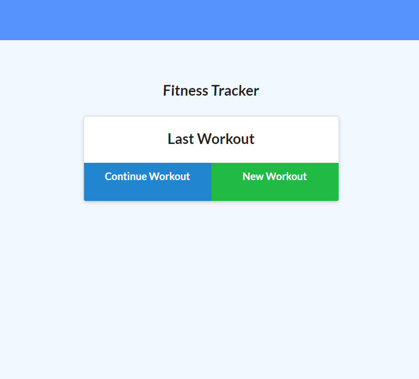

# Fitness-Tracker
Fullstack Homework

## Description

## Table of Contents
1. [Install Instructions](#install-instructions)
2. [Usage Instructions](#usage-instructions)
3. [License](#license)
4. [Contribution Guidelines](#contribution-guidelines)
5. [Test Instructions](#test-instructions)
6. [Questions](#questions)

## Install instructions

Run npm i or npm install.
Open database.

## Usage Instructions

Navigate to 

## User Story

* As a user, I want to be able to view, create, and track the results of my workouts. I should be able to input information for logging as many exercises as I get completed in a workout on any given day. The exercises can be tracked by name, type, weight, sets, reps, and duration. For cardio, I should be able to track distance traveled.

## Screenshots
</img>
</img>

## Contribution Guidelines

## Test Instructions

## Questions

If you have any questions, contact the author:  

https://github.com/cdcolbert
